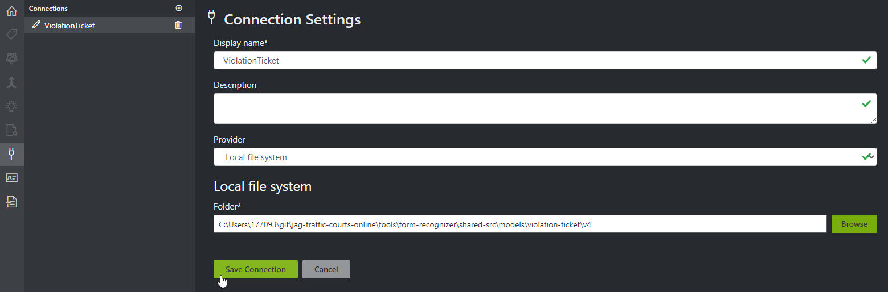
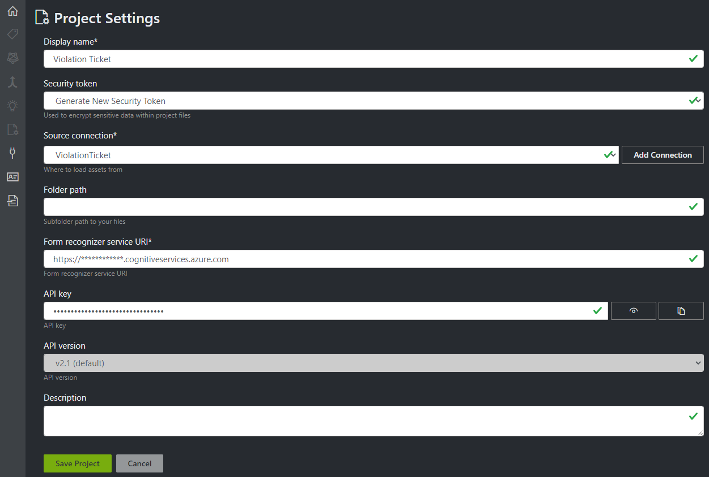

# Form Recognizer

This folder contains the necessary configuration and code needed to run a local containerized instance of Azure's Form Recognizer v2.1-preview.  The instance consists of 4 containers:
* azure-cognitive-service-proxy (an nginx router to the below services)
* azure-cognitive-service-custom-api (main api to the service)
* azure-cognitive-service-custom-layout (the container that does all the work)
* azure-cognitive-service-custom-supervised (tracks billing, submits to Azure)

```
    ├─ docs                       # docs and images
    ├─ logs                       # a shared folder used by Docker (above images)
    ├─ shared                     # a shared folder used by Docker (above images)
    └─ shared-src                 # src of the Violation Ticket OCR model
       ├─ formrecognizer          # a generated folder created/used by Form Recognizer
       └─ models                  # a parent folder of custom models
          └─ violation-ticket     # a parent folder of custom models specific to TCO
             ├─ v1                # v1 of the TCO model, contains ticket images and training results
             └─ v4                # current version of the TCO Violation Ticket model
    Dockerfile.layout             # a custom layout dockerfile with shared-src baked into the image
    Dockerfile.proxy              # a custom proxy dockerfile with nginx.conf baked into the image
    init.sh                       # an init script used by layout to copy shared-src into shared at startup
    nginx.conf                    # nginx configuration used by the proxy container
```

The main 3 containers (`custom-api`, `custom-layout`, and `custom-supervised`) all share 2 folders, `logs` and `shared`. The `logs` folder is used to capture all standout logging by any of the 3 containters. The `shared` folder is the main folder containing the custom models, runtime analysis results, etc. These folders must be read/write accessible by all three containers.  

At startup of the `custom-layout` container, the shared-src folder (which is baked into the image) is copied to the common `shared` folder to initialize the folder structure.

## Notes on Form Recognizer versions

At the time of writing, the latest version of Azure Form Recognizer is 2022-06-30-preview (a preview for v3.0). The [Form Recognizer Studio v3.0](https://formrecognizer.appliedai.azure.com/studio) web application can be used to build and train v3.0 models - it is backwards compatible and can train models using v2.1 labelled data.

However, the latest version of Form Recognizer that is designed to run in containers is v2.1 (running the OCR tool either locally in Docker or in OpenShift). Version 2.1 is not forward compatible with v3.0 models, meaning models hosted in 2.1 must be trained using 2.1 labels.  Microsoft provides an online [Form Recognizer Sample Labeling tool (FOTT)](https://fott-2-1.azurewebsites.net/) designed for v2.1, but this web app assumes the data is hosted in an Azure blob container, not a local file system. Fortunately, per [FAQ](https://docs.microsoft.com/en-us/azure/applied-ai-services/form-recognizer/faq#can-i-use-local-storage-for-the-form-recognizer-sample-labeling-tool--fott--container-), Microsoft also provides a verison of FOTT that uses local storage and can be downloaded from [this location](https://github.com/microsoft/OCR-Form-Tools/releases/download/v2.1-ga/oflt-2.1.3-win32.exe).

## How to Train Form Recognizer v2.1-preview

Using a local instance of FOTT:
1. Click the `Connections` icon on the left menu to create a new Connection to the model. Give it a name, select `Local file system` as the Provider, and browse to the location of the model you wish to create, ie (tools\form-recognizer\shared-src\models\violation-ticket\v5). 


2. Click the `Use Custom to train a model with labels and get key value pairs` button on the home screen and then click New Project.


3. Fill out the Project Settings form and click Save Project. Under Source connection, select the connection you created in step 1. Specify the billing url and API key and click Save Project.


4. Use the tool to correctly label text on each sample Violation Ticket image.  This will generate *.labels.json files in the model folder.


5. Once labeling is complete, it's time to train the model.  This is accomplished using the custom-api docker instance. From the root of the project, bring up a local instance of Form Recognizer.

```
docker-compose -f docker-compose.yml -f .docker/docker-compose-ocr.yml up -d
```

When the instance comes up, your new model files in shared-src/models should have been copied to the shared/models folder at startup.

6. Use the API's [Swagger UI](http://localhost:5200/swagger/index.html) or Postman to query the API and to train the new model. Postman calls are documented here.

GET to find all existing trained models:
```
curl -L -X GET 'http://localhost:5200/formrecognizer/v2.1/custom/models' -H 'Accept: application/json'
```

POST to train your new model:
```
curl -L -X POST 'http://localhost:5200/formrecognizer/v2.1/custom/models' -H 'Content-Type: application/json' -H 'Accept: application/json' --data-raw '{
  "source": "/shared/models/violation-ticket/v5",
  "sourceFilter": {
    "prefix": "",
    "includeSubFolders": false
  },
  "useLabelFile": true,
  "modelName": "Violation Ticket v5",
  "apiVersion": "v2.1"
}'
```

After training, your new model should be available in the first query.

7. Training should have generated new files in the `shared/formrecognizer` folder. Copy these newly generated files back to `shared-src` and commit them to GIT.

