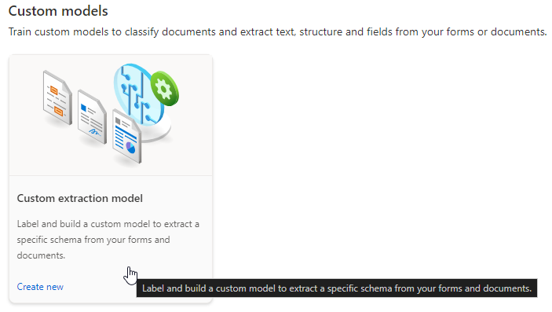
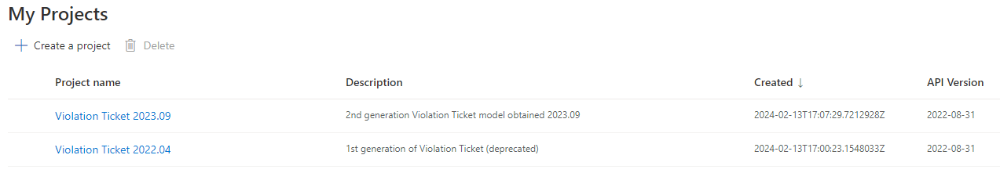

# Form Recognizer

This folder contains the necessary configuration and code needed to run a local containerized instance of Azure's Form Recognizer 3.0. 
At the time of writing, the latest API version that is available as an on-prem install is version [2022-08-31 (GA)](https://mcr.microsoft.com/product/azure-cognitive-services/form-recognizer/custom-template-3.0/tags).

The instance consists of 4 containers:
* proxy (an nginx router to the below services)
* custom-template (main api to the service)
* layout (the container that does all the work)
* studio (the container used to create/modify the underlying models during development). This container is not deployed to OpenShift.

There are 2 other containers used to initalize the data for the above services
* init-model (copies data from this repo (/backup/shared) to the /shared folder used by layout and custom-template)
* init-studio (copies data from this repo (/backup/db, /backup/files) to the /db and /files used by studio)

```
    ├─ backup                     # src of the Violation Ticket OCR models
    |  ├─ db                      # a folder containing data specifically for running Studio
    |  ├─ files                   # a parent folder of custom models
    |  |  ├─ 2022.04              # a directory of images that can be used to train the VT1 model
    |  |  └─ 2023.09              # a directory of images that can be used to train the VT2 model
    |  └─ shared                  # a directory containing a snapshot of the trained models after running Studio
    ├─ docs                       # this folder, docs and images
    ├─ db                         # a shared folder used by studio (created by docker at runtime)
    ├─ files                      # a shared folder used by studio (created by docker at runtime)
    ├─ logs                       # a shared folder used by layout and custom-template (created by docker at runtime)
    └─ shared                     # a shared folder used by layout and custom-template (created by docker at runtime)
    .env.template                 # an example .env file that must exist before launching docker-compose
    docker-compose.yml            # a docker compose file to launch the full instance of Form Recognizer for model-training purposes
    Dockerfile.initModels         # a simple linux container used to initialize the /shared folder
    Dockerfile.initStudio         # a simple linux container used to initialize the /db and /files folders
    init-models.sh                # an init script used by .initModels to seed data in the /shared folder
    init-studio.sh                # an init script used by .initStudio to seed data in the /db and /files folder
    nginx.conf                    # nginx configuration used by the proxy container
```

The 2 main containers (`custom-template`, and `custom-layout`) all share 2 folders, `logs` and `shared`. The `logs` folder is used to capture all standout logging by either containter (though this folder always seems to be empty). The `shared` folder is the main folder containing the custom trained models, runtime analysis results, etc. These folders must be read/write accessible by both containers.  

## How to Train Form Recognizer 3.0 (2022-08-31)

Version 3.0 now comes with a docker instance of Studio that can be used to train custom models.

1. Bring up the instance and navigate to Studio:
`docker-compose up -d --build`
Studio is available here: http://localhost:5001/studio

2. Click into to the Custom models section:


3. Both models should appear in the list. The 2022.04 was the inital Violation Ticket model (now known as VT1). This model was deprecated by the client when the new and improved ticket was released (2023.09). The new ticket layout is now known as VT2.

One can navigate into either of these models to modify and retrain the model if needed. The models tab shows a 3rd model. This 3rd model is a Composite model of the VT1 and VT2 models. This is the main model used by the TCO application. This model will automatically detect which format of ticket images are supplied to the analyze request (VT1 or VT2) and then use the approprate underlying model to do the actual analysis.


4. If any change are made to either model, retrain by clicking the **Train** button at the top right. The update model will exist in the `/shared` volume used by the `custom-template` container. Copy this data to the `/backup/shared` folder so that it can be seeded into subsequent builds.

## How to launch Form Recgonizer 3.0

To launch the instance to further train the models:
`docker-compose up -d --build`
One can then test the models by accessing the Custom Forms API: http://localhost:5000/swagger/index.html

To launch the instance with the TCO application, from the root of this project run:
`docker-compose -f docker-compose.yml -f .docker/docker-compose-ocr.yml up -d --build`
